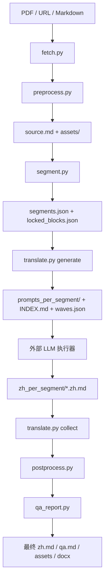

# qiq-tech-paper-trans

`qiq-tech-paper-trans` 是一个用于将英文技术论文翻译为中文的 skill，重点面向 AI/ML 与通用技术论文，目标是在保留论文结构的前提下生成忠实、流畅、适合阅读的中文译文。

## 期望解决的问题

- 有些技术论文的排版比较特殊，直接给大模型翻译之后内容有点乱。
- 翻译之后把原文中的图和表格会有缺失的情况。
- 翻译大段内容的时候，会出现不忠于原文进行翻译，中间自行简要概括。
- PDF 解析结果不稳定，复杂表格容易在 Markdown 或 Word 中破坏排版。

## 主要功能

- 支持本地 PDF 与论文 URL 输入，arXiv 链接会优先使用 HTML 版本。
- 保留标题层级、图片、表格、公式、代码块和引用编号。
- 采用滑动窗口翻译单元，兼顾上下文连贯与术语一致。
- 默认从 `References` / `Bibliography` 开始截断，不翻译参考文献及其后内容。
- 表格默认以图片方式保留，减少复杂表格乱码和排版损坏。
- 提供质检报告，发现正文、图表、公式、引用等缺失时阻断输出。
- 可选输出双语对照 Markdown 与 Word 文档。

## 整体实现架构

项目采用 **prepare → 外部 LLM 翻译 → finalize** 的三段式流水线。核心脚本只负责论文抓取、预处理、分段、prompt 生成、译文组装和质检；真正的 LLM 调用通过 `prompts_per_segment/*.prompt.md` 与 `zh_per_segment/*.zh.md` 这组文件协议交给宿主平台或外部执行器完成，因此不绑定特定模型 API 或 Agent 平台。



### 主要模块职责

- `scripts/run.py`：总入口和阶段编排，负责 `prepare` / `finalize` 流程、参数透传、最终产物落盘。
- `scripts/fetch.py`：解析输入来源；支持本地文件、普通 URL、arXiv PDF / HTML 优先策略。
- `scripts/preprocess.py`：将 PDF / HTML / Markdown 转为结构化 `source.md`，处理 Marker、分块、fallback、断点续跑和进度心跳。
- `scripts/table_extractor.py`：检测 PDF 表格区域并裁剪为图片，配合默认的 `--table-strategy image` 保持复杂表格排版。
- `scripts/segment.py`：按段落或章节生成翻译单元，锁定公式、代码、图片、表格等不可翻译块，并截断 References 后内容。
- `scripts/translate.py`：生成滑动窗口翻译 prompt、`INDEX.md`、`waves.json`，并在 finalize 阶段收集 `zh_per_segment/` 译文。
- `scripts/postprocess.py`：回贴锁定块，规范中英文排版，生成最终 Markdown 正文。
- `scripts/qa_report.py`：执行阻断级质检，检查段落、图片、表格、公式、代码、引用、References 泄漏等问题，并生成返修 prompt。
- `scripts/pack.py`：辅助打包发布。

### 核心中间产物

- `source.md`：预处理后的统一 Markdown 源文。
- `assets/`：预处理阶段抽取或生成的原始图片资源。
- `preprocess_chunks/`：大 PDF 分块处理目录，包含每块的 `status.json` 以及整体 `progress.json` / `heartbeat.json`。
- `masked.md`：锁定不可翻译块后的源文。
- `locked_blocks.json`：公式、代码、图片、表格等锁定块映射。
- `segments.json`：分段结果。
- `translation_units.json`：实际需要翻译的单元定义。
- `prompts_per_segment/`：每个翻译单元对应的 LLM prompt。
- `waves.json`：可并行翻译的 wave 调度信息。
- `zh_per_segment/`：外部 LLM 执行器写回的单元译文。
- `translated_raw.md`：收集单元译文后的原始中文稿。
- `<paper_stem>.zh.md`：最终中文译文。
- `<paper_stem>.qa.md`：质检报告。
- `<paper_stem>.assets/`：finalize 阶段镜像出的译文专属图片目录。

### PDF 预处理策略

PDF 预处理采用 **小文件整篇 Marker + 大文件分块 Marker + 单块 fallback** 的组合策略：

- 小 PDF 默认整篇交给 Marker，超时或失败时回退到 `pymupdf`。
- 大 PDF 自动切为多个页段，每个分块独立执行 Marker，失败时按 `--chunk-fallback` 回退为 `pymupdf`、`skip` 或 `fail`。
- 分块状态记录在 `preprocess_chunks/<chunk_id>/status.json`，配合 `--resume` 可复用成功分块。
- `progress.json`、`heartbeat.json` 和控制台心跳用于长时间运行时确认任务仍在执行。
- 默认表格策略为 `image`，即通过 `pdfplumber` 检测表格区域，再用 `pymupdf` 裁剪为 PNG 插回 Markdown，避免复杂表格在 Markdown / Word 中乱排。

### 扩展点

- 替换或新增 PDF 解析引擎，只需保持输出 `source.md` 与 `assets/` 协议稳定。
- 接入不同 LLM 平台，只需读取 `prompts_per_segment/` 并写回 `zh_per_segment/`。
- 增加新的 QA 规则，可扩展 `qa_report.py` 的阻断检查。
- 增加新的导出格式，可在 finalize 阶段基于最终 Markdown 和 `<paper_stem>.assets/` 生成。
- 扩展术语表或 prompt 模板，可通过 `glossary.json` 与 prompt 生成逻辑调整。

## 基本使用

```bash
python3 scripts/run.py \
  --input /path/to/paper.pdf \
  --outdir /path/to/output
```

也可以输入论文 URL：

```bash
python3 scripts/run.py \
  --input https://arxiv.org/abs/2403.xxxxx \
  --outdir /path/to/output
```

常用选项：

- `--bilingual`：额外输出双语对照 Markdown。
- `--export-docx`：额外导出 Word 文档，需要本机安装 `pandoc`。
- `--resume`：断点续译，复用已有中间产物。
- `--force`：跳过阻断级质检，仅建议在明确知道风险时使用。

更完整的运行协议与参数说明见 `SKILL.md`。
